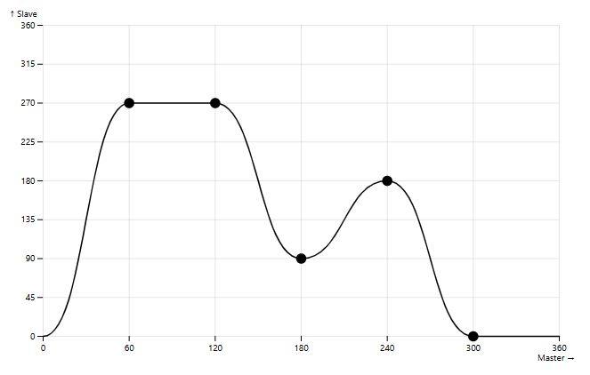
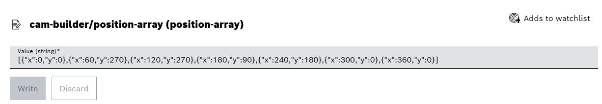

# ctrlX Cam Builder

This python app deploys a simple webserver that provides a user interface for configuring a cam profile. The coordinates of the adjustable profile points are provided on a datalayer node in the format of a json string.

